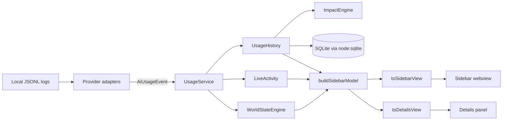

# CarbonBit

CarbonBit is a VS Code extension (TypeScript, no bundler) that reads **local** session logs of AI coding tools,
normalizes them into usage events, estimates energy / CO₂e / water, stores metadata in a local SQLite database
and shows it in a sidebar webview with a reactive 16-bit pixel world.

Source of truth for product behavior: [docs/PRD.md](docs/PRD.md) (code comments reference it as `PRD §N`).
Source of truth for formulas and factors: [docs/METHODOLOGY.md](docs/METHODOLOGY.md).

## Commands

| Task | Command |
| --- | --- |
| Install | `npm install` (CI uses `npm ci`, Node 22) |
| Build | `npm run compile` (`tsc -p ./` → `out/`) |
| Watch | `npm run watch` (default build task; usually already running) |
| Lint | `npm run lint` (ESLint on `src` and `media`) |
| Test | `npm test` (runs compile + lint first, then `out/test/**/*.test.js` in a VS Code instance) |
| Debug | **F5** → Run Extension (Extension Development Host) |

Definition of done for any change: `npm run compile` and `npm run lint` are clean, and `npm test` passes.
CI ([.github/workflows/ci.yml](.github/workflows/ci.yml)) runs exactly these on Ubuntu (`xvfb-run -a npm test`).

## Architecture

All wiring lives in [src/extension.ts](src/extension.ts). Activation never awaits provider discovery
(`void usage.start()`), and view updates are throttled (`VIEW_THROTTLE_MS`).

### Layout

| Path | Responsibility |
| --- | --- |
| `src/extension.ts`, `src/commands.ts` | Activation, wiring, command registration. |
| `src/core/usage/` | `AiUsageEvent` contract + runtime validation; `UsageService` runs adapters with failure isolation. |
| `src/core/providers/` | One folder per tool: `*Adapter.ts` (discovery/tailing) + `*Parser.ts` (line → events). `shared/jsonlTailAdapter.ts` is the base class. |
| `src/core/impact/` | `ImpactEngine`, confidence, units, model registry. **All factor data** lives in `impact/data/`. |
| `src/core/storage/` | `UsageStore` (SQLite, migrations), `UsageHistory` (retention, aggregation), `openUsageStore` (corruption recovery, in-memory fallback). |
| `src/core/world/` | World state machine and intensity rules. |
| `src/core/view/` | Pure view models (sidebar, details, live activity). |
| `src/core/messages/` | Host ⇄ webview protocol types + runtime validators (`protocol.ts`, `detailsProtocol.ts`). |
| `src/core/settings/` | `normalize*` functions that sanitize raw configuration values. |
| `src/core/diagnostics/` | Redacted diagnostics report. |
| `src/sidebar/`, `src/details/` | Webview providers, HTML generation, message handling. |
| `media/` | Plain browser JS/CSS shipped as-is (no build step). `media/world/` = pixel renderer (`scene.js`, `effects.js`, `renderer.js`). |
| `src/test/` | Mocha (TDD UI) tests, harnesses, fakes and `fixtures/<provider>/*.jsonl`. |

## Hard rules (invariants)

1. **Privacy first.** Only metadata (ids, provider, model, timestamps, status, token counts) may leave a parser.
   Never store, log, post to a webview or include in diagnostics any prompt, response, code, file name, path,
   repo, branch, user name or workspace name. Logs report error **codes** only (see `jsonlTailAdapter.ts`).
2. **No network, no telemetry.** Do not add HTTP calls, analytics or remote assets. Webviews use a strict CSP
   (`default-src 'none'`, nonce-only scripts); keep it that way — no inline scripts/styles, no CDN.
3. **Keep `src/core/**` free of `vscode` imports.** Only `extension.ts`, `commands.ts`, `sidebar/*Provider.ts`,
   `details/detailsPanel.ts` and `test/extension.test.ts` may import `vscode`. Core code takes plain
   callbacks/options (e.g. `log`, `Disposable` from `providers/provider.ts`) so it is unit-testable.
4. **Adapters only discover and parse.** They never compute impact. Emit `AiUsageEvent`s that pass
   `validateAiUsageEvent` (unknown fields are rejected on purpose). `cachedInputTokens` and
   `cacheCreationTokens` are **excluded** from `inputTokens` — subtract them if the source includes them.
5. **Providers fail independently.** A broken log format, missing folder or exception in one adapter must not
   affect others or activation. Unknown fields/record types are ignored; malformed lines are counted, not thrown.
6. **Estimates, not measurements.** Every figure carries confidence + reasons. Don't present numbers as precise
   and don't add judgmental/guilt UX (PRD §56).
7. **Environmental values live only in `src/core/impact/data/environmentalFactors.ts`**, each with sources,
   assumptions and limitations. Any change to factors or formulas must bump `methodology.version` (semver) and
   update [docs/METHODOLOGY.md](docs/METHODOLOGY.md). Stored rows record the methodology version.
8. **SQLite migrations are append-only.** Add a new entry to `MIGRATIONS` in `usageStore.ts`; never edit or
   reorder existing ones (`SCHEMA_VERSION = MIGRATIONS.length`, tracked via `PRAGMA user_version`).
   Use `node:sqlite` only — no native modules or wasm.
9. **Message contracts are locked.** Changing `AiUsageEvent`, `AiProviderAdapter` or any webview message shape
   requires updating the validators in `core/messages/` **and** the compile-time shape locks in
   [src/test/contracts.test.ts](src/test/contracts.test.ts). All host → webview messages go through
   `postToWebview`; all webview → host messages through `handleWebviewMessage` (invalid input is ignored).
10. **Command ids stay in sync** across `package.json` `contributes.commands`, `COMMAND_IDS` in
    [src/commands.ts](src/commands.ts) and, if callable from the sidebar, `SIDEBAR_COMMANDS` in `protocol.ts`.

## Recipes

**Add a provider**
1. Add the id to `AI_PROVIDER_IDS` in `core/usage/usageEvent.ts` (and the contract lock in `contracts.test.ts`).
2. Create `core/providers/<tool>/` with a parser implementing `JsonlFileParser` and an adapter extending
   `JsonlTailAdapter` (see `claudeCode/` for the minimal pattern; export a `<tool>Dirs(env, home)` helper that
   honors the tool's env overrides).
3. Register it in `extension.ts` (`usage.register(...)`, CLI tools use `pollIntervalMs: CLI_POLL_MS`).
4. Add fixtures under `src/test/fixtures/<tool>/` (normal, `partial`, `malformed`) where every content field is a
   `CANARY_*` placeholder, and tests using `createTailHarness`, `assertCanaryOnly` and `assertNoContent`.
5. Update the README "Supported tools" table, `CHANGELOG.md` and `docs/MANUAL_TEST_CHECKLIST.md`.

**Add or reclassify a model** — edit `core/impact/data/modelAliases.ts` (families are ordered; more specific
patterns like `-mini` before broader ones) and bump its `version`; add cases to `modelRegistry.test.ts`.

**Add a setting** — declare it in `package.json` `contributes.configuration`, add a `normalize*` function in
`core/settings/` with tests, read it in `extension.ts`, react in `onDidChangeConfiguration`, document it in README.

**Add a command** — `package.json` + `COMMAND_IDS` + handler in `registerCommands({...})` in `extension.ts`
+ README commands table.

**Change webview UI** — `media/*.js` are browser scripts (ES2022, `sourceType: script`, no imports); new globals
must be declared in `eslint.config.mjs`. Respect `carbonbit.visualMode`, `animation.enabled`, `maxFps`,
`prefers-reduced-motion` and pause when hidden. Use VS Code theme CSS variables; check Dark/Light/High Contrast.
Text pre-formatting (units) is done on the host (`core/impact/units.ts`), not in the webview.

## Testing conventions

- Mocha TDD UI: `suite(...)` / `test(...)` with Node `assert` (`strictEqual`, `deepStrictEqual`).
- Tests run from `out/test`; fixtures stay in `src/test/fixtures` (resolved via `FIXTURES_ROOT`).
- Prefer pure, deterministic tests: use `fakeClock.ts` for time, `fakeDom.ts` + `vm` for `media/*.js`
  (see `webviewAssets.test.ts`), temp dirs for files/SQLite, and clean up in `teardown`.
- Only `extension.test.ts` should depend on the real VS Code API.
- [src/test/acceptance.test.ts](src/test/acceptance.test.ts) covers the end-to-end pipeline; extend it when a
  change crosses layers. Live-tool and UI behavior goes in [docs/MANUAL_TEST_CHECKLIST.md](docs/MANUAL_TEST_CHECKLIST.md).
- Every bug fix gets a regression test; every parser change gets a fixture.

## Code style

- TypeScript `strict`, `module: Node16`, target ES2022, CommonJS output. Tabs for indentation, single quotes,
  semicolons, `===`, curly braces always (ESLint enforces `curly`, `eqeqeq`, `semi`).
- Prefer `as const` arrays + derived union types with runtime guards (pattern in `usageEvent.ts`, `protocol.ts`).
- Use `import type` for type-only imports. Small, focused modules; no new runtime dependencies without a strong
  reason (the extension currently ships with **zero** runtime dependencies).
- Comments: one short line explaining *why*; reference `PRD §N` when implementing a requirement.
- User-facing strings: calm, factual, no blame; always describe figures as estimates.

## Docs to keep in sync

| Change | Update |
| --- | --- |
| User-visible feature, setting, command | `README.md`, `CHANGELOG.md` (`[Unreleased]`) |
| Factors, formulas, confidence, model mapping | `docs/METHODOLOGY.md` + version bump |
| Provider support or log versions checked | README "Supported tools" + manual checklist |
| Scope/behavior decisions | `docs/PRD.md` only if the product owner asks |

## Gotchas

- Don't delete `out/` while `npm run watch` is running; it can leave `out/extension.js` missing. Just recompile.
- `npm test` downloads VS Code into `.vscode-test/` on first run; it may be slow. Compile + lint must still pass.
- With `module: Node16`, type-only imports from ESM-only packages fail with TS1541/TS1542 — avoid them.
- Provider log formats are internal and change between releases: parse defensively, keep unknown records
  ignored, and record the checked tool versions in the README.
- Copilot Chat sessions of **all** workspaces are found under the VS Code user folder (derived from
  `context.globalStorageUri`); remote windows read logs on the extension host side.
- On start, adapters import logs modified since the `carbonbit.lastTrackedAt` checkpoint (globalState, saved with a
  margin after the import finishes). Until `carbonbit.historyBackfill` reaches `BACKFILL_VERSION` the import instead
  reaches back to the retention window (max `BACKFILL_DAYS`); bump the version to backfill existing installs again. Imported events carry origin `import`: stored, but never fed to the world or
  live activity. Keep parsing chunked/yielding — real logs reach hundreds of MB.
- The database may be shared by several VS Code windows; keep writes idempotent (upsert by event id) and
  migrations safe under concurrency (`BEGIN IMMEDIATE`).
