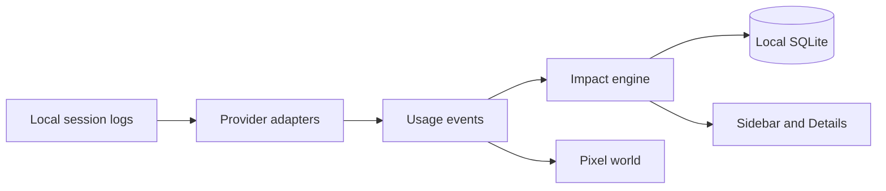

<!-- prettier-ignore -->
<div align="center">


# CarbonBit

*A live environmental monitor for AI-assisted software development*

[](https://github.com/kasuken/vscode-carbonbit/actions)
[](https://code.visualstudio.com)
[](https://www.typescriptlang.org)


⭐ If you like this project, star it on GitHub — it helps a lot!

[Overview](#overview) • [Features](#features) • [Getting started](#getting-started) • [Usage](#usage) • [How estimates work](#how-estimates-work) • [Privacy](#privacy-and-local-data) • [Troubleshooting](#troubleshooting)

</div>

CarbonBit is a VS Code extension that turns your AI coding activity into understandable environmental impact
estimates. It reads the local session logs of the AI tools you already use, estimates the **energy**, **CO₂e**
and **water** behind each request, and shows it all in the sidebar alongside a reactive 16-bit pixel world that
comes alive whenever an AI model is working for you.

Everything runs and stays on your machine: no API keys, no telemetry, no network requests.

> [!IMPORTANT]
> CarbonBit provides **estimates, not direct measurements**. Real impact depends on model infrastructure,
> hardware, location, batching, caching and provider operations. Every figure carries a confidence level and
> the reasons behind it. See the [methodology](docs/METHODOLOGY.md) for formulas, factors, sources and limitations.

## Overview

Tokens, watt-hours and grams of CO₂e are abstract. CarbonBit makes them tangible: when you send a prompt, a
data center in the sidebar powers up, electricity flows down the power line, cooling fans spin and data packets
travel back to a pixel developer at their desk. The bigger the model and the request, the busier the scene.
When nothing is happening, the world stays calm.

The goal is awareness, not guilt: CarbonBit does not discourage AI usage, score your prompts or track your
productivity. It helps you answer a few simple questions:

- Which AI tools and models am I using, and how much?
- What is their estimated environmental impact today?
- What is happening right now?
- How confident is each estimate?



### Supported tools

| Tool | Local source (override) | Token counts | Versions checked |
| --- | --- | --- | --- |
| GitHub Copilot Chat | `workspaceStorage/*/chatSessions/*.jsonl` and `globalStorage/emptyWindowChatSessions` of the running VS Code (all workspaces) | prompt and completion per request | VS Code internal format |
| Claude Code | `~/.claude/projects/**/*.jsonl` (`CLAUDE_CONFIG_DIR`, `XDG_CONFIG_HOME/claude`) | input, output, cache read and cache write per API response | 2.1.260–2.1.284 |
| GitHub Copilot CLI | `~/.copilot/session-state/<id>/events.jsonl` (`COPILOT_HOME`, `XDG_CONFIG_HOME/.copilot`) | output per model call; input and cache totals at session shutdown | 0.0.384–1.0.91 |
| Codex CLI | `~/.codex/sessions/YYYY/MM/DD/rollout-*.jsonl` (`CODEX_HOME`) | input, cached input and output per turn | 0.130–0.159 |

Each provider starts, stops and fails independently, so one broken log format never takes the others down.

Usage from every project is tracked, whichever VS Code window or terminal it comes from. When CarbonBit starts,
it imports in the background the usage logged since it last ran (on first run: since local midnight, and never
beyond `carbonbit.dataRetentionDays`). Imported requests count towards totals and history, but don't animate
the world.

## Features

- **Multi-tool tracking**: GitHub Copilot Chat, Claude Code, GitHub Copilot CLI and Codex CLI, read from their local session logs.
- **Reactive 16-bit world**: idle, request starting, light/medium/heavy processing, response and failure states.
- **Live metrics**: active provider, model and tokens, a last-hour activity chart, session counters and per-tool shares.
- **Everyday comparisons**: CO₂e and water for today, the last 30 days, the previous month and a projected year, each shown as km driven, kettle boils, mugs of tea, shower minutes and more.
- **Transparent estimates**: per-model figures with High/Medium/Low confidence and the reasons behind each one.
- **Versioned methodology**: every stored request records the methodology version used, so figures stay reproducible.
- **Three visual modes**: `environmental`, `neutral` or `minimal`, plus FPS cap, reduced-motion support and pause when hidden.
- **Local-first and private**: SQLite history with configurable retention, one-click data clearing and a redacted diagnostics report.

## Getting started

### Requirements

- [VS Code](https://code.visualstudio.com) 1.138 or later (CarbonBit uses the built-in `node:sqlite`, no native modules).
- At least one [supported tool](#supported-tools) installed and used on the same machine as the VS Code extension host.
- [Node.js](https://nodejs.org) LTS and [Git](https://git-scm.com) to build from source.

### Run from source

1. Clone the repository and install dependencies:

   ```bash
   git clone https://github.com/kasuken/vscode-carbonbit.git
   cd vscode-carbonbit
   npm install
   ```

2. Open the folder in VS Code and press **F5** (**Run Extension**) to start an Extension Development Host.
3. Select the CarbonBit leaf icon in the Activity Bar, or run **CarbonBit: Open** from the Command Palette.
4. Send a request with any supported tool and watch the world react.

> [!TIP]
> Installed a tool after CarbonBit started? It is detected within about 30 seconds, or run **CarbonBit: Refresh Usage** to check right away.

## Usage

### The pixel world

Two rooms joined by one wire: the developer's room on the left, the data hall on the right. The sky follows your
local time of day (dawn, day, dusk, night). See [docs/WORLD_ART.md](docs/WORLD_ART.md) for the art direction.

| State | What you see |
| --- | --- |
| Idle | A calm scene: drifting clouds, a bird on the wire, the developer typing now and then. |
| Request starting | A cyan request travels along the wire to the data hall. |
| Processing | Server racks light up, power flows and cooling vapour rises; intensity is light, medium or heavy. |
| Response | A green reply returns to the monitor and a check mark appears, then the scene settles. |
| Failure | A slow amber lamp blinks in the data hall; nothing red, nothing alarming. |

Claude Code and Copilot CLI write each model call to their logs only once it has finished. When such calls follow
each other within 15 seconds, CarbonBit treats them as one agent loop at work and keeps the world processing.

### The sidebar

- **Live strip**: status, provider, model, tokens of the latest request, and how long ago it finished.
- **Last hour**: tokens per two minutes as pixel bars (hover a bar for its time and count), plus requests, tokens and CO₂e since VS Code started.
- **Footprint**: pick Today, 30 days, Last month or Year. Each CO₂e and water figure lists what it is about the same as. The year is projected from your recorded days of usage in the last 30 days.
- **Tools today**: each tool's share of today's tokens.

Intensity is the heavier of two signals: the model class (small → light, medium → medium, frontier → heavy) and
the request size (8,000+ tokens → medium, 40,000+ tokens → heavy). In `environmental` mode, heavy processing also
makes the sky briefly more industrial.

### Commands

| Command | Description |
| --- | --- |
| **CarbonBit: Open** | Reveals the CarbonBit sidebar. |
| **CarbonBit: Refresh Usage** | Re-reads provider logs now and re-checks tools that were not detected. |
| **CarbonBit: Show Details** | Shows today's totals, provider shares and per-model figures with confidence. |
| **CarbonBit: Show Methodology** | Shows the factors, assumptions, limitations and sources behind the estimates. |
| **CarbonBit: Clear Local Data** | Deletes all locally stored usage after confirmation. |
| **CarbonBit: Open Diagnostics** | Opens a shareable, redacted report for troubleshooting. |

### Settings

| Setting | Default | Description |
| --- | --- | --- |
| `carbonbit.visualMode` | `environmental` | `environmental` (environmental cues), `neutral` (servers, power and cooling without degradation) or `minimal` (no complex animation). |
| `carbonbit.animation.enabled` | `true` | Animate the pixel world. When off, each state shows a still frame. |
| `carbonbit.animation.maxFps` | `30` | Animation frame-rate cap (1–60). |
| `carbonbit.dataRetentionDays` | `90` | Days of local history to keep: `7`, `30`, `90`, `365` or `0` (unlimited). |

## How estimates work

CarbonBit prefers token counts reported by each tool (**actual**). When a finished request has none, it estimates
them from text length at ~4 characters per token (**estimated**). A request missing only its input or output
count is **partial**. Text is measured in memory and never stored.

Tokens are then converted using the `carbonbit-impact` methodology (v1.0.0):

```text
weightedInput = inputTokens + cachedInputTokens × 0.1 + cacheCreationTokens × 1
energyWh      = weightedInput × whPerInputToken + outputTokens × whPerOutputToken
carbonGrams   = energyWh / 1000 × 480 g CO₂e/kWh
waterLiters   = energyWh / 1000 × 1.1 L/kWh
```

- **Energy** per token depends on the model class (small, medium, frontier), anchored on ~0.3 Wh per typical query.
- **Carbon** uses the 2023 global average grid intensity of 480 g CO₂e/kWh.
- **Water** covers on-site data center cooling only, at 1.1 L/kWh.
- **Confidence** starts from how precisely the model was matched and drops one step when token counts are estimated or partial.

> [!NOTE]
> No published per-model energy measurements exist yet for the models CarbonBit sees, so confidence currently
> tops out at **Medium**. Training, embodied hardware and your own device's energy are not included.

The full formulas, factor tables, model mapping rules and sources are in [docs/METHODOLOGY.md](docs/METHODOLOGY.md).

## Privacy and local data

CarbonBit only extracts request metadata from local logs: ids, model names, timestamps, status and token counts.

| | What CarbonBit does |
| --- | --- |
| **Reads** | Local provider session logs, only for the metadata above. |
| **Stores** | One row per request (provider, model, timestamps, status, token counts and their source, estimates, confidence, methodology version). Never prompts, responses, code, file names or paths. |
| **Sends** | Nothing. No telemetry, no network requests. Methodology source links open only when you click them. |
| **Logs** | Provider state changes and error codes in the **CarbonBit** output channel, without conversation content. |

Usage is stored in a SQLite database at `<VS Code global storage>/emanuelebartolesi.vscode-carbonbit/carbonbit.db`.

- Requests older than `carbonbit.dataRetentionDays` are deleted at startup, every few hours and whenever the setting changes.
- **CarbonBit: Clear Local Data** deletes all stored usage; settings are kept.
- "Today" starts at local midnight; the "session" starts when CarbonBit activates in the window.
- If the database is unreadable, it is moved aside (`carbonbit.db.corrupt-<time>`) and recreated. If it still can't be opened, usage is kept in memory for the session and a warning is shown.

## Known limitations

> [!WARNING]
> Provider log formats are internal to each tool, not public APIs, and may change between releases. Unknown
> fields and record types are ignored; the versions checked are listed in [Supported tools](#supported-tools).

- Activity from before CarbonBit started is imported into history but not replayed into the live world. A
  request that was still running when the previous run ended and is still running now is picked up once it finishes.
- GitHub Copilot Chat: only sessions of the VS Code installation CarbonBit runs in are visible (e.g. Insiders does
  not see Stable's chats), and cache token counts are not recorded.
- GitHub Copilot CLI: requests show *partial* confidence until the session's shutdown summary adds input and cache totals. Sessions already running when CarbonBit started, or that exit without a summary, never get those totals.
- Remote windows (SSH, WSL, Dev Containers, Codespaces): logs are read on the extension host, so tools running on the other side are not seen.

## Troubleshooting

- Open the **CarbonBit** output channel to see each provider's state: `tracking`, `unavailable` (tool not found), `failed` (could not start) or `stopped`, plus skipped malformed lines and read errors (by error code only).
- Run **CarbonBit: Refresh Usage** after installing or first using a tool.
- Run **CarbonBit: Open Diagnostics** to get a report with CarbonBit, VS Code and OS versions, per-provider detection, last update times and database health. Home folder, user name and workspace names are redacted, so you can safely attach it to an [issue](https://github.com/kasuken/vscode-carbonbit/issues).

## Development

| Script | Description |
| --- | --- |
| `npm run compile` | Compiles the TypeScript sources to `out/`. |
| `npm run watch` | Recompiles on change (default build task). |
| `npm run lint` | Lints `src` and `media` with ESLint. |
| `npm test` | Compiles, lints and runs the test suite in a VS Code instance. |

Automated tests cover the deterministic pipeline from provider adapters to views, including an end-to-end
[acceptance journey](src/test/acceptance.test.ts). VS Code and live provider integration is covered by the
[manual test checklist](docs/MANUAL_TEST_CHECKLIST.md).

## Resources

- [Environmental methodology](docs/METHODOLOGY.md): formulas, factors, confidence and sources.
- [Product requirements](docs/PRD.md): vision, scope and design of CarbonBit.
- [How much energy does ChatGPT use?](https://epoch.ai/gradient-updates/how-much-energy-does-chatgpt-use) (Epoch AI, 2025)
- [Measuring the environmental impact of delivering AI at Google scale](https://arxiv.org/abs/2508.15734) (Google, 2025)
- [Global Electricity Review 2024](https://ember-energy.org/latest-insights/global-electricity-review-2024/) (Ember)
